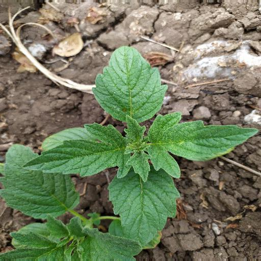
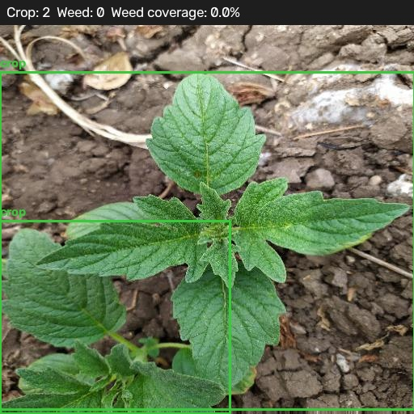
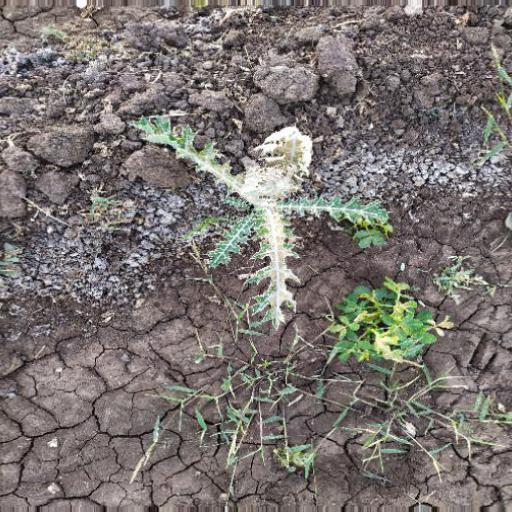
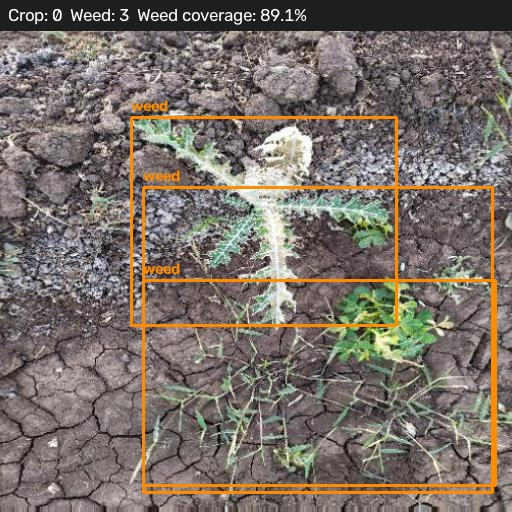

# FarmEye-AI

A crop/weed detector built on YOLOv8. Point it at a field image (or a folder
of them) and it reports how many crop plants and weeds it found, plus a
rough estimate of how much of the frame is weed.

## What's in this repo

```
train_farmeye.py     trains the model
analyze_field.py      runs the trained model on images and reports results
verify_labels.py      sanity-check for label files before training
split_dataset.py      splits raw images/labels into train/val/test
data.yaml              class definitions + dataset paths
farmeye_results/       annotated output images
farmeye_report.txt     per-image text report from the last run
```

## The model

Trained with `train_farmeye.py`, starting from `yolov8n.pt` (Ultralytics
YOLOv8, nano size — picked for speed over the larger variants). Two
classes, defined in `data.yaml`:

```
0: crop
1: weed
```

Training settings: 512x512 images, batch size 16, up to 100 epochs with
early stopping after 20 epochs of no improvement.

```
python train_farmeye.py
python train_farmeye.py --epochs 50 --model yolov8s.pt
```

Best weights land at `runs/farmeye/farmeye_train/weights/best.pt`.

**Note:** the last training run didn't leave behind `results.csv` or
`results.png`, so there aren't saved mAP/precision/recall numbers from
training to point to here. The results below are from running the trained
model on a held-out set, not from the training logs.

## Running it

```
python analyze_field.py --source dataset/images/test
python analyze_field.py --source path/to/one_photo.jpg --weights runs/farmeye/farmeye_train/weights/best.pt
```

For each image, `analyze_field.py`:
1. Runs the model to get crop/weed boxes
2. Counts detections per class
3. Estimates weed coverage as `(sum of weed box areas) / (image area) * 100`
4. Draws the boxes back onto the image with a summary banner
5. Saves the annotated image to `farmeye_results/`
6. Writes a text report across every image processed

Example output banner:

```
Crop: 2  Weed: 0  Weed coverage: 0.0%
```

### A known quirk in the coverage number

Coverage is added up from box areas, not actual pixel overlap. If weed
boxes overlap each other (a cluster of weeds close together, for
example), the percentage can go over 100. A few examples from the last
run: `agri_0_1868.jpeg` came out at 150.7%, `agri_0_3228.jpeg` at 106.0%,
`agri_0_5711.jpeg` at 102.2%. It's not a bug — it's just a bounding-box
estimate rather than a pixel-level one, and the code comments already
call this out. Worth knowing before reading too much into any single
number over 100%.

## Results from the last run

131 test images processed:

- 219 crop detections
- 118 weed detections
- 27.2% average weed coverage across all images

Two examples, raw image next to what the model found:

### Example 1 — crop, no weed

`agri_0_6504.jpeg`: `Crop: 2  Weed: 0  Weed coverage: 0.0%`

<table>
<tr><td>Raw</td><td>Detected</td></tr>
<tr>
<td></td>
<td></td>
</tr>
</table>

### Example 2 — mostly weed

`agri_0_6411.jpeg`: `Crop: 0  Weed: 3  Weed coverage: 89.1%`

<table>
<tr><td>Raw</td><td>Detected</td></tr>
<tr>
<td></td>
<td></td>
</tr>
</table>

Full per-image numbers are in `farmeye_report.txt`.

## Setup

```
python -m venv venv
venv\Scripts\activate
pip install -r requirements.txt
```

Main dependencies: `ultralytics`, `torch`, `opencv-python`. Full pinned
list is in `requirements.txt`.

## Known gaps

- No saved mAP/precision/recall from training — only inference-time
  detection counts and coverage estimates above.
- Weed coverage is a bounding-box area estimate, not true segmentation
  (see note above).
- No interface/UI built yet — results are viewed directly as annotated
  images and the text report. Whether one gets added depends on what this
  project actually needs to be delivered as.
