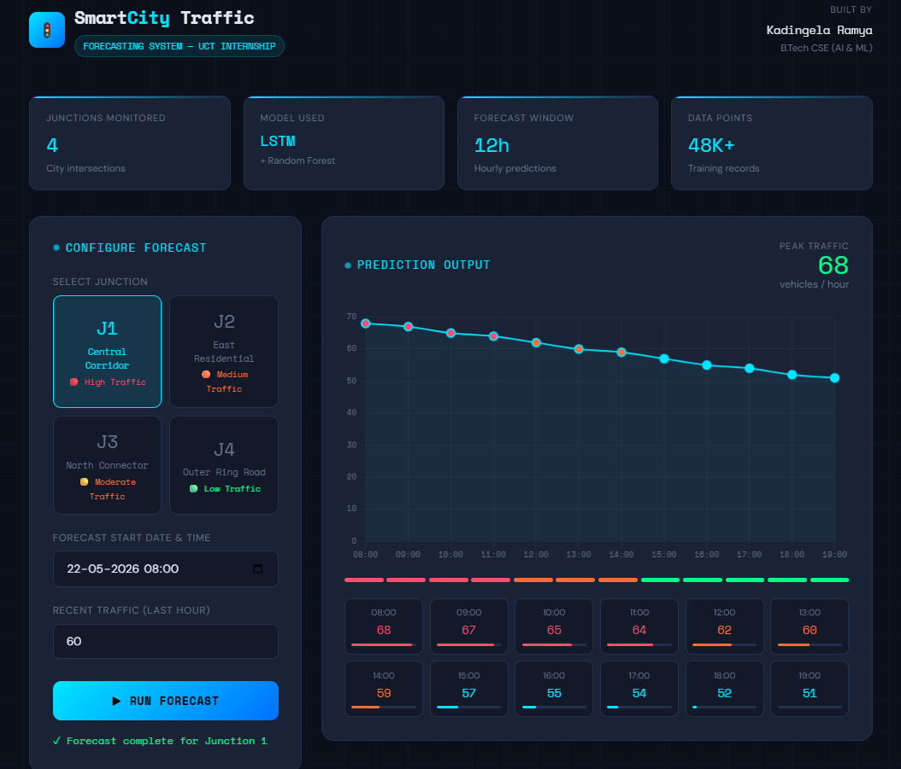
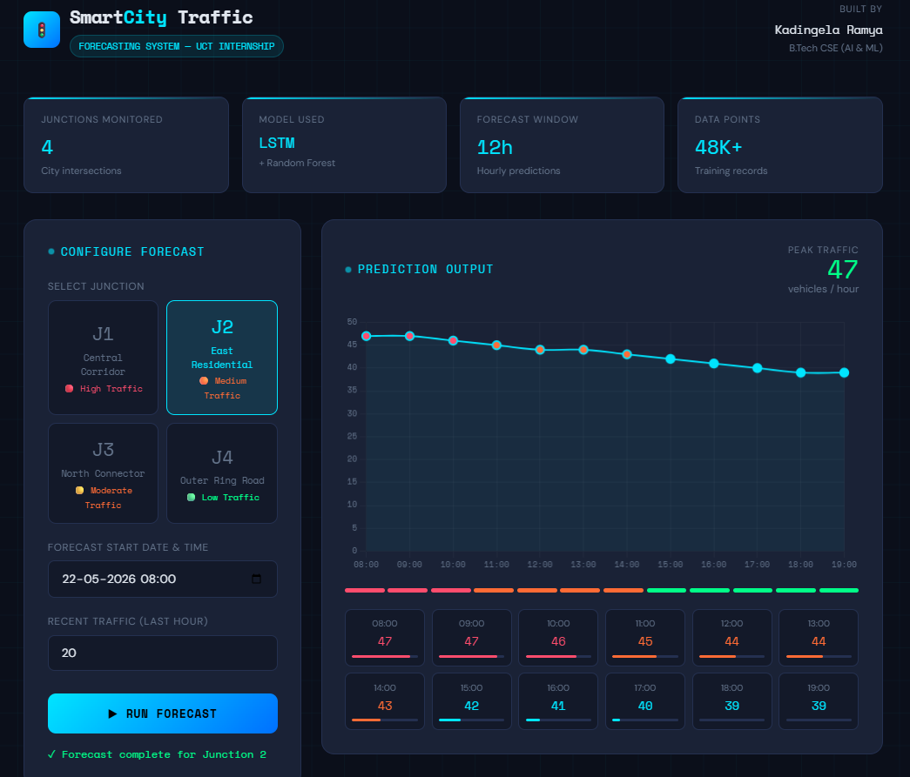
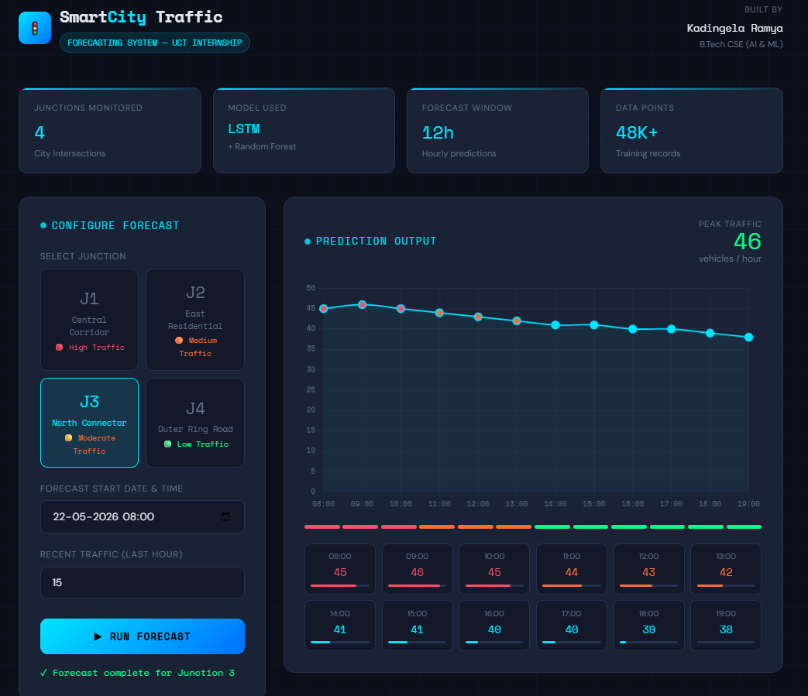
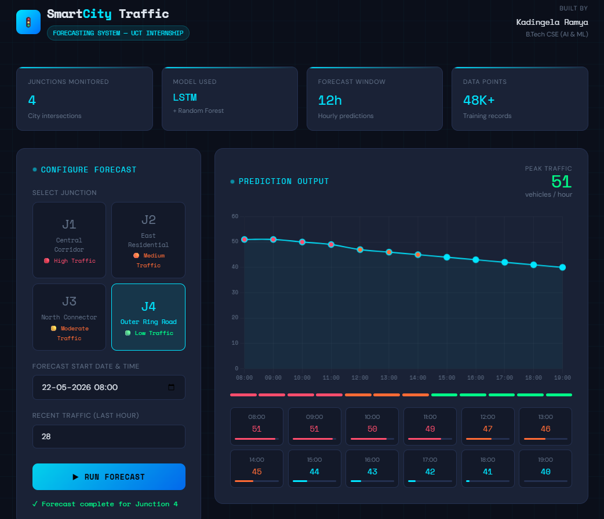

# Smart City Traffic Forecaster

A web application that predicts hourly traffic volume at city junctions using an LSTM neural network. Built as part of my UCT internship to explore how machine learning can help cities manage traffic more efficiently.

---

## What it does

You pick a junction, set a time, and the app tells you how many vehicles are expected at that junction for the next 12 hours. The predictions come from a real trained model — not hardcoded rules or random numbers.

The idea is simple: if a city knows that Junction 1 will hit peak traffic at 9am, signal timings can be adjusted in advance instead of reacting after congestion already builds up.

---

## Screenshots

| Junction 1 | Junction 2 |
|------------|------------|
|  |  |

| Junction 3 | Junction 4 |
|------------|------------|
|  |  |

---

## Dataset

- Source: Kaggle — Traffic Flow Forecasting dataset
- 4 anonymous city junctions monitored over ~20 months (Nov 2015 – Jun 2017)
- 48,120 hourly records total
- Junction 1 is the busiest (avg 45 vehicles/hr), Junction 4 is the quietest (avg 7 vehicles/hr)

---

## Model

I trained a two-layer LSTM network on the historical data. The input features include hour of day, day of week, weekend flag, week of year, and lag values from previous hours. The model outputs a single value — predicted vehicle count for that hour.

After training, the model achieved a Mean Absolute Error of around 3.24 vehicles/hour on the test set, which means its predictions are typically within 3–4 vehicles of the actual count.

Architecture:
- LSTM layer (64 units) → Dropout 20%
- LSTM layer (32 units) → Dropout 20%
- Dense layer (16 units, ReLU)
- Output layer (1 unit, linear)

---

## Tech stack

- Python 3.10
- TensorFlow / Keras — model training and inference
- Flask — web server and API
- Chart.js — prediction graph on the frontend
- HTML, CSS, vanilla JS — dashboard UI
- scikit-learn — data scaling
- joblib — saving and loading scalers
- Pandas, NumPy — data processing

---

## How to run it locally

**1. Clone the repo**
```bash
git clone https://github.com/KaindegelaRamya/smart-city-traffic-forecaster.git
cd smart-city-traffic-forecaster
```

**2. Install dependencies**
```bash
pip install -r requirements.txt
```

> If you get a NumPy conflict, run: `pip install "numpy<2"`

**3. Make sure model files are present**

The following files must be in the root folder:
- `lstm_weights.weights.h5`
- `scaler_X.pkl`
- `scaler_y.pkl`

**4. Start the app**
```bash
python app.py
```

Open your browser at `http://127.0.0.1:5000`

---

## Project structure

```
smart-city-traffic-forecaster/
├── app.py                      # Flask app and prediction logic
├── requirements.txt            # Python dependencies
├── save_model.py               # Script used in Colab to export model
├── lstm_weights.weights.h5     # Trained model weights
├── scaler_X.pkl                # Feature scaler
├── scaler_y.pkl                # Target scaler
├── templates/
│   └── index.html              # Dashboard UI
├── screenshots/
│   ├── j1.png
│   ├── j2.png
│   ├── j3.png
│   └── j4.png
└── README.md
```

---

## What I learned

Training a model is only half the work. Getting it to actually run in a different environment — with different library versions — turned out to be the harder problem. I ran into Keras version conflicts between Colab and my local machine, which forced me to understand how model serialization works and how to rebuild an architecture from scratch and load only the weights.

The dashboard went through a few iterations too. I wanted it to feel like something a city operator would actually use — not just a notebook output — so I spent time on the layout, the hourly cards, and the color-coded traffic bar.

---

## Author

**Kadingela Ramya**
B.Tech CSE (AI & ML)
UCT Internship Project — 2026
